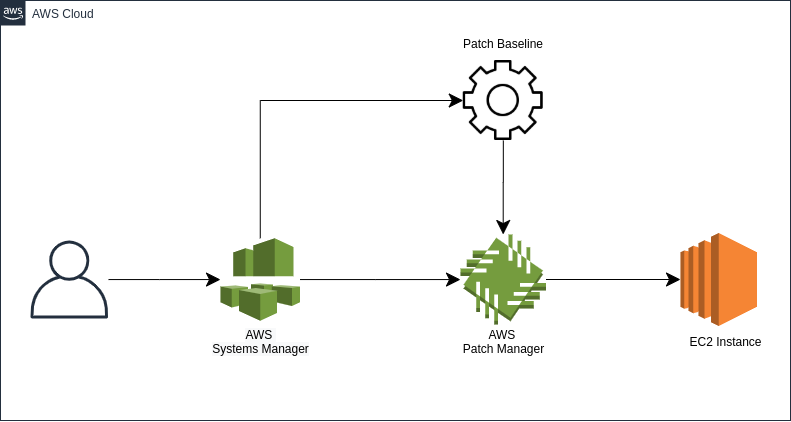

# <center>Security Patching of EC2 Instances</center> 

#### Aim:

The Aim is to do the Security Patching on EC2 Instances. The solution uses AWS SSM Patch Manager and AWS SSM Automation. This solution has both manual and automated ways to do the patching on EC2 Instances.

#### Solution Architecture:

> Below is the high-level overview for the solution

<br />


#### Solution Approach:

The approach for the Solution would be:

1. The admin installs the SSM agent on the EC2 Instance.
2. The admin creates a custom baseline where only Security Patches would get selected.
3. The admin patches the EC2 Instance using the Patch Manager in SSM. 


#### Prerequisites:

1. SSM should be installed and running on the instances which need to be patched.
<br />

[Click Here for AWS SSM Installation Documentation](https://docs.aws.amazon.com/systems-manager/latest/userguide/sysman-manual-agent-install.html)
<br />

2. Custom Patch Baseline should be created where we define to use Security Patches only
<br />

[Click Here for AWS Custom Patch Baseline Documentation](https://docs.aws.amazon.com/systems-manager/latest/userguide/create-baseline-console-linux.html)
<br />


#### Step-1: Go to AWS System Manager: 

<br />
<br />

#### Step-2: Scroll down to Patch Manager and click on Configure Patching:

<br />


<br />
<br />

#### Step-3: Enter the Instance Tags that need to be patched and click on add:
<br />


<br />
<br />

#### Step-4: Scroll down and Select “skip scheduling and patch instances now”, “Scan and install” and Configuring patching:
<br />


<br />
<br />

#### FAQ: 

1. How to install the SSM Agent?
2. How to create a custom patch baseline?


```
aws create 

```

> Here you can create some example


* Bullet Points
* Sub Bullet points


- Bullet -1

1. Numbered List
2. Number 2


[Link to Github](https://github.com)




A horizontal rule follows.
***


